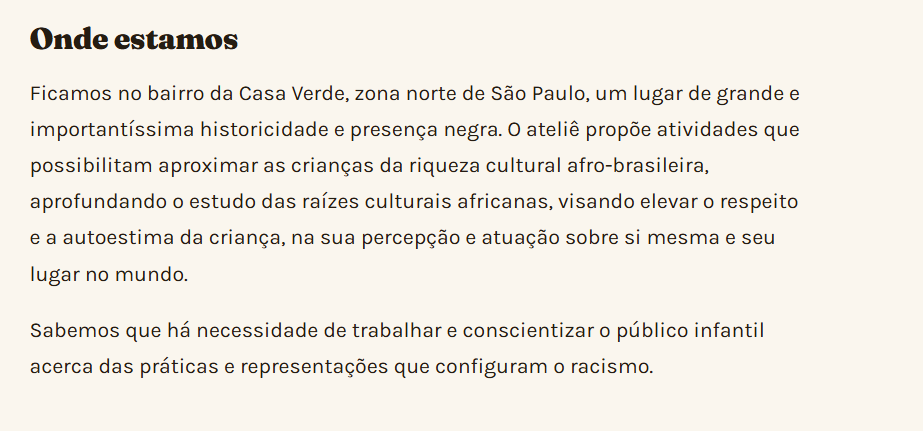

# Venturus - Atelie

# Alterações V1

- Quebrando letras quando aumenta o tamanho da fonte pelos botões de acessibilidade.
- Ocultar formulário de postagem para todas as páginas e trocar por um botão. Assim que o admin clicar, o forms aparece.
- Popup para confirmar todas as ações do admin e usuário dentro da aplicação.
- Confirmação dupla para ações perigosas/destrutivas (Ex: deletar projeto, noticia, foto e etc)
- Usuário criou sua conta, em seguida ele deve ser logado instantaneamente.
- Popup assim que uma candidatura de voluntariado for feita, o user deve ver esse popup e ser redirecionado para a home.
- Na hora do usuário criar conta ele deve inserir o tipo de pessoa: física ou jurídica.
- PERGUNTA: Como evitar o possível problema de ter 1 pessoa com 2 ou mais contas.
- Instruções para admins e user devem ser melhores escritas, com destaques para palavras importantes, em bullet points.
- Ajuste de ícone do navegador
- Máscara de telefone onde tem o campo de telefone (página de contato por exemplo não está aplicando a máscara. Garantir validação em todos os campos)

### Menu:

- Mudar o design desse menu sem perder a facilidade
- Colocar uma opção de botão do painel do admin (assim que ele fizer o login na sua conta)
- Colocar a acessibilidade de tamanho de fonte acoplada ao menu.
- Colocar uma opção minha conta.

### Início:

- Melhorar o design para atrair a atenção do usuário colocando imagens e ícones.

### Quem somos:

- Melhorar o design para atrair atenção do usuário colocando imagens e ícones.
- Imagens dos founder da Ong
- Tela do Google maps da abaixo da sua localização
    - Imagem da página
    
    
    

### Projetos:

- Colocar imagens dos projetos
- Criar na página do admin um botão para "Adicionar projeto" e ai abre um formulário mostrando os campos de: nome, resumo, sinopse, ficha técnica, imagens.
- Na página de projetos do usuário deve ser assim: pequenos blocos, se a pessoa quiser ver o projeto ela clica em "saber mais" e abre uma página dedicada ao respectivo projeto.

### Agenda:

### Notícias:

- Admin poder colocar imagens nas notícias
- Página de notícias do usuário deve ser assim: pequenos blocos, se a pessoa quiser ver a notícia ela clica em "saber mais" e abre uma página dedicada a respectiva noticia.

### Galeria:

- Usuário clica na imagem e ela abre igual a galeria do celular (pode passar pelas fotos e etc)
- Ter uma menção ao respectivo projeto que a aquela foto da galeria pertence.

### Apoiar

```
Fluxo:

DOADOR: se doar dinheiro selecionar valor mostrar chave pix qr code doador escaneia e paga marca que doou
ADMIN: aparece no painel que o doador pagou se registrar que recebeu então isso conta no numero total de doações

DOACAO DE ITENS: DOADOR: doador seleciona item descreve o que vai ser doado
ADMIN: aparece no painel que recebeu doação de item entra em contato direto com o doador para passar informações como caixa postal etc assim que recebe o item, marca como recebido e então o item é contabilizado no numero total de itens doados
```

- GAP na resposta do admin para o user sem mudança de status da solicitação.
- GAP na mudança de tipo de doação:
    - Item → descrever o item e solicitar.
    - dinheiro → Passar quantia e marcar que pagou.
    - importante: mostrar popup/na página agradecimento pela doação

### Contato:


- Adicionar ícones nas redes sociais e tipos de contatos
- A parte de onde estamos colocar o mapa do google também, igual na página inicial

### Rodapé:

- Ícone nas redes sociais e tipos de contatos
- Logo do Atelie no rodapé

### Página de admin:

- **Parte de Voluntários:**
    - Páginação de quase tudo
    - Filtro: nome, email, cpf/pj, áread e atuação e status da candidatura.
    - Na hora de ver as candidaturas o admin deve ver assim: Listar nome + info importante e para ver os detalhes ele clica em “ver mais”.

Design geral para as páginas do ADMIN:

- Instruções para admins e user devem ser melhores escritas, com destaques para palavras importantes, em bullet points.
- Paginação de todas as páginas
- Quando for listar qualquer tipo de info que use blocos na página, ela deve ser comprimida para: listar nome + info importante (depende da página) e o admin clica em ver mais para ver os detalhes.
- 

## APENAS SE DER TEMPO!!! Idéias/sugestões de melhoria

- Dashboard com gráficos por mês de doação em $ e itens, exemplo:
    - Gráfico de barra para meses/doações
    - Gráfico de pizza para tipos de doadores (PF, PJ etc)
    - Mais gráficos de acordo com a necessidade, pensando sempre em manter uma melhor experiência mobile
- Integração com gateway de pagamentos para processar/contabilizar automaticamente (depende de alinhamento com Atelie)


